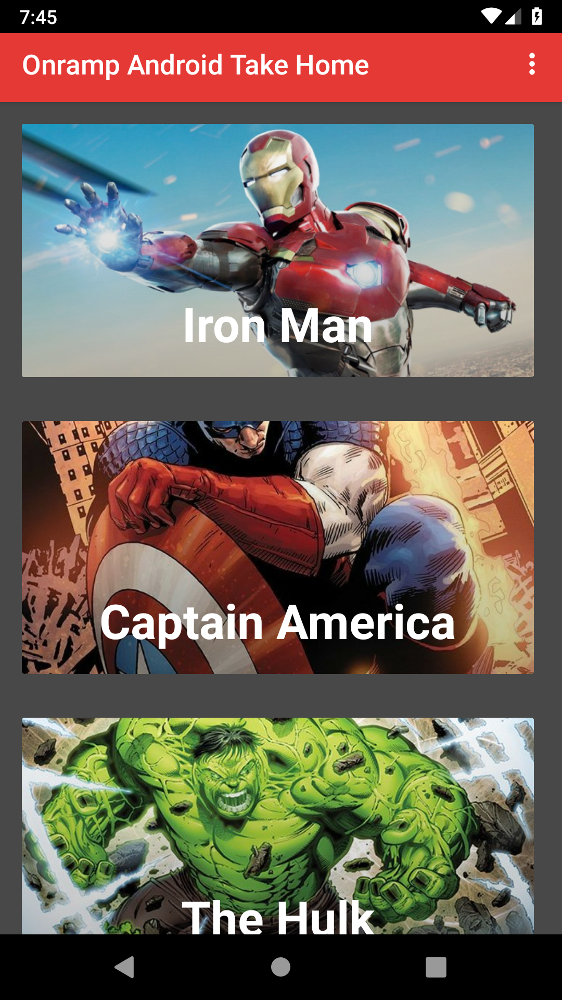
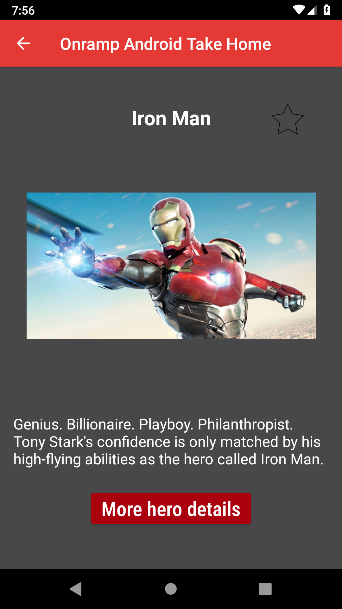
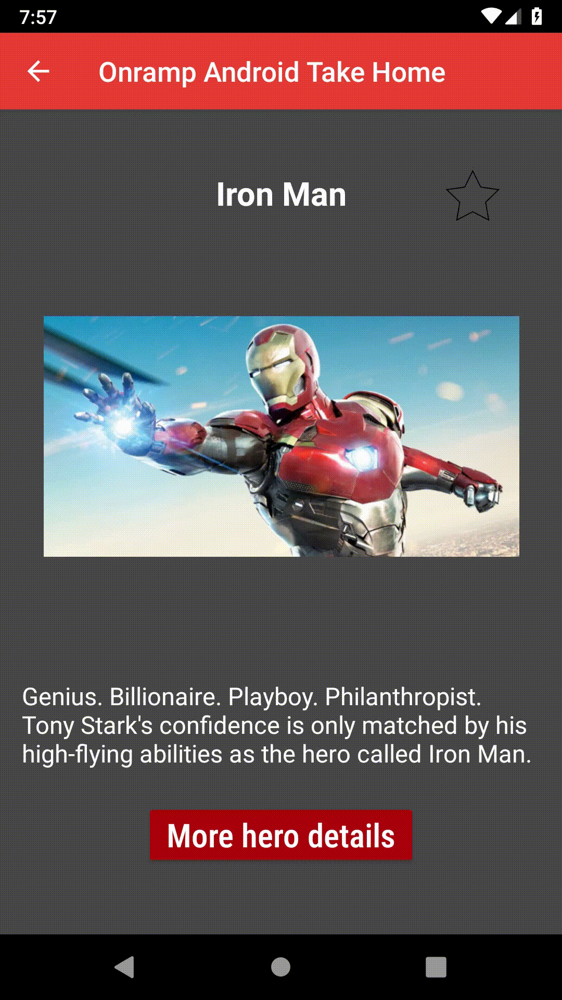
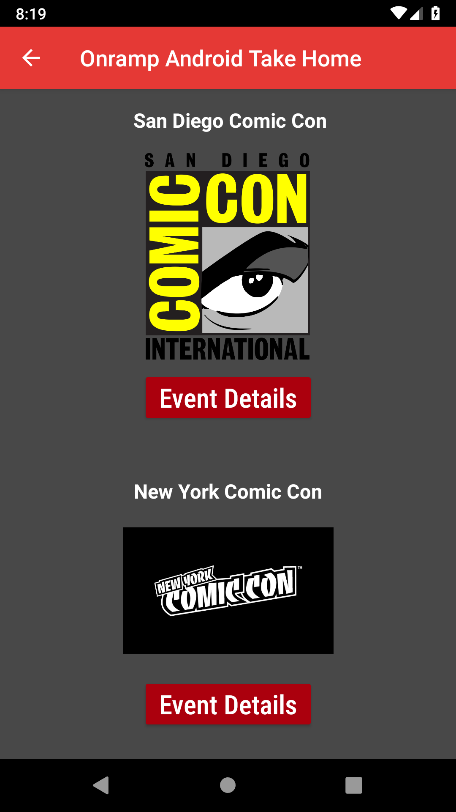
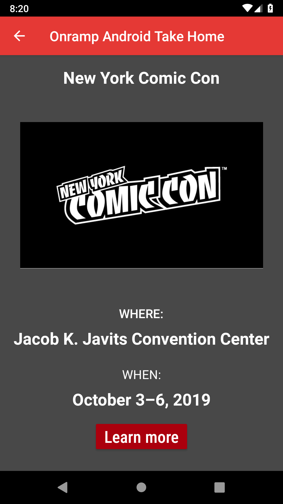
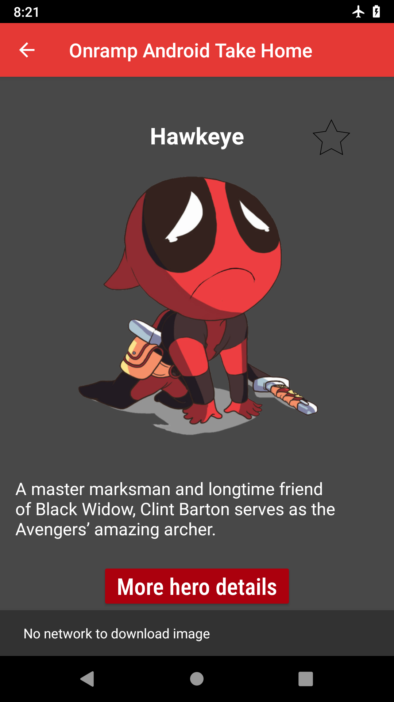

# Marvel Toy App 

## Overview 🤖

In honor of the last Avengers movie, which is coming out soon, I decided to make a small app involving the first Avengers that were introduced to us in the Marvel Cinimatic Universe 10 years ago. It's a relatively simple app, but it was fun to make and I'll most likely keep adding to this project and use it as a sandbox to try new things.

## Built with:

- Picasso - Handles image loading and caching
- Parceler - Made working with parcelable objects easier
- Timber - For simple logging convenience
- Lottie - Used for 'favorite' animation
- MVVM architecture 
- Material Design components
- Repository pattern for further abstraction and seperation of concerns 
- ROOM - Abstraction layer over SQLite
- Databinding - Basic usage to minimize 'findviewbyid' calls

## Description and Details of each screen below 🔎

There will be descriptions of each app screen below every screen shot

### Activity #1

The above screenshot is the entry point of the app. 

- I adjusted the colors in colors.xml so coincide with Marvel's color scheme. I chose to use a dark grey as the background, because I felt it had good contrast between the views and app bar. 

- I created a shape file named 'scrim.xml' so I can place the the scrim over the imageViews in the app and improve the readability of the white text over the images.

- The data used in the activity is being retrieved from the ViewModel, while the ViewModel is retrieving the data from a helper class that constructs the Hero objects from data stores in strings.xml. That way, I wouldn't have to build each Hero data model in any UI related classes.

- Picasso is loading the images inside the RecyclerviewAdaper class. I'm using a placeholder image in case there's no network. (Placeholder image will be posted below)

-  This activity implements a collapsing toolbar (shown below)

- All imageViews in this activity (and all app screens) have progressBars shown until the image is fully loaded with Picasso

### Activity #2

The above screenshot is the destination screen once the user clicks on an item from the recyclerView in the MainActivity.

- The star image is a LottieAnimationView(LAV). I use it as a simple animation button that indicates that the Hero is placed in the ROOM database or not. Once the LAV is clicked, the current Hero data is sent to the HeroRepository class, which then uses a Service to complete the database event on a background thread, so we don't block the UI thread.

- Also, when the LAV is clicked, a snackbar pops up to let the user know that they added or removed the hero to the database. (gif below to show both the Lottie animation and snackbar in action)

- I use a Material Design button as the "More Hero Details" button. When clicked it creates a simple ACTIONVIEW intent that sends the user to the Hero's profile on Marvel.com. The style for this button is defined in styles.xml and reused for all buttons in the app. (gif below shows actionView event. Takes a while to load browser because of my slow wifi lol)

- When this activity first launches, I query the ROOM database to see if the currently selected hero exists in the database. If it does, I'll fill in the Lottie animation view to signify that to the user and I'll also set a flag in the activity that it's already in the database and if the user clicks to REMOVE the Hero, the correct action is performed. (via onClickListeners on the LottieAnimationView)

### Activity #3

The above screenshot is the destination the user is brought to if they click on the overflow menu item 'Events'. It's a very  simple activity. I could have done more here, but I honestly needed a reason to use a Fragment. Therefore, those buttons underneath each event image opens a fragment with the event details. Nothing fancy here. Again, all the data for the app is in memory besides the image urls, so I'm just passing along the data via Bundles and Intents.

### Fragment (one and only)

The above screenshot is another simple screen. The fragment receives the data passed in from bundle arguments and inflates the data for the event based on which event was clicked in the previous screen. The button below sends the sends the user to that specific events website so they can learn more about the event. (gif below shows entire 'Event' flow)

### Placeholder image when there's no network

Having no internet makes deadpool sad =(

### 5 Material Design Components

I explained some of these in the above descriptions so I'll list them off here again and where they are located.

- AppBar with Collapsing toolbar in MainActivity
- Progressbar is in every imageview to indicate that content is loading. Once Picasso loads image, I set it to INVISIBILE via a callback inside Picasso
- Material Design Button is used throughout the app and styled consistently with styles.xml
- Material Design Cards are used for the RecyclerView in MainActivity
- Snackbars are used to inform the user of database events in the HeroOverviewActivity

### Service 

I used a simple Service to do the database transactions in a background thread. With the startActivity intent, I pass in a bundle that has 2 parameters. One is the Hero to be inserted\removed and the second is a String key that designates whether it's a 'Insert' or 'Delete" action. Once the Service receives that data, it calls the HeroRepository, which then accesses the ROOM DOA and completes the database transaction

# What I messed up =(

Here are a few things that I realized I could've done better or things I knew I should have done, but I didn't because I needed to submit this project on time before an interview. 'Maybe' if I hadn't wasted the first two days trying to get RetroFit to work with Marvel's API, I could have polished this up a little more. That's my bad for overcomplicating things and trying to be cool. Anyway, lesson learned. Here are some other things I messed up. Enjoy.

- Landscape is a little messy (really messy actually), so I would definitely need to fix that through adjusting my Constraint layouts and defining landscape specific layouts.

- I'm using MVVM to allow for more abstraction and seperation of concerns, but I realized that after initializing the data when the app launches, I pass around all the data through Intents and bundles. Therefore the data in my other screens are NOT  saved from device rotation. In hindsight, I probably would have created a ViewModel for each screen.

- I made a "InjectorUtils" class that creates a single instance of the HeroRepository. I probably should've utilized this seperation of concerns more to improve app scalability and ease of testing components in isolation. I'm learning Dagger 2, so hopefully that will help out in that area. 

- I use an Async task in the HeroOverviewActivity to check the database if the current entry exists. I know Asyncs are outdated and I'm looking to add RXjava to my coding toolkit soon so I can avoid Asyncs in the future.

- There are definitely more strings that I should have placed in string.xml folder

- I forgot to do a lint check -_-
